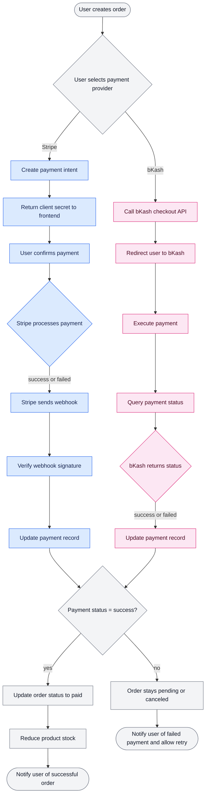

# Payment Flow Diagram

```mermaid
flowchart TD
  start([User creates order]) --> provider{User selects payment provider}

  provider -->|Stripe| stripeIntent[Create payment intent]
  stripeIntent --> stripeSecret[Return client secret to frontend]
  stripeSecret --> stripeConfirm[User confirms payment]
  stripeConfirm --> stripeProcess{Stripe processes payment}
  stripeProcess -->|success or failed| stripeWebhook[Stripe sends webhook]
  stripeWebhook --> stripeVerify[Verify webhook signature]
  stripeVerify --> stripeUpdate[Update payment record]

  provider -->|bKash| bkashCheckout[Call bKash checkout API]
  bkashCheckout --> bkashRedirect[Redirect user to bKash]
  bkashRedirect --> bkashExecute[Execute payment]
  bkashExecute --> bkashQuery[Query payment status]
  bkashQuery --> bkashStatus{bKash returns status}
  bkashStatus -->|success or failed| bkashUpdate[Update payment record]

  stripeUpdate --> paid{Payment status = success?}
  bkashUpdate --> paid

  paid -->|yes| orderPaid[Update order status to paid]
  orderPaid --> reduceStock[Reduce product stock]
  reduceStock --> successEnd([Notify user of successful order])

  paid -->|no| orderPending[Order stays pending or canceled]
  orderPending --> failedEnd([Notify user of failed payment and allow retry])

  classDef stripe fill:#dbeafe,stroke:#2563eb,color:#172554;
  classDef bkash fill:#fce7f3,stroke:#db2777,color:#500724;
  classDef shared fill:#f3f4f6,stroke:#6b7280,color:#111827;

  class stripeIntent,stripeSecret,stripeConfirm,stripeProcess,stripeWebhook,stripeVerify,stripeUpdate stripe;
  class bkashCheckout,bkashRedirect,bkashExecute,bkashQuery,bkashStatus,bkashUpdate bkash;
  class start,provider,paid,orderPaid,reduceStock,successEnd,orderPending,failedEnd shared;
```
